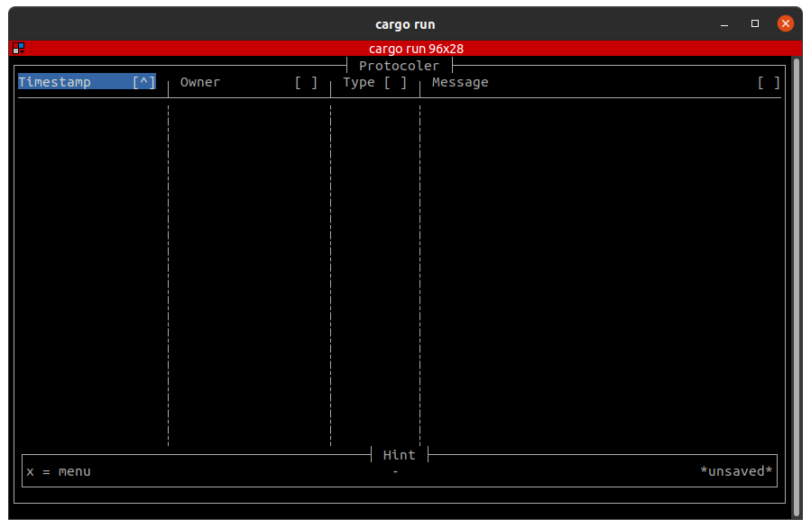

# protocoler

[](https://github.com/corka149/protocoler/actions/workflows/rust.yml)

> A minimalistic typer for protocols

A Fast and minimalistic protocol generator powered by Rust.
It can output protocols in different formats.

## Usage

`protocoler` is a Text-based UI app. Run `protocoler` and press x for help.



## Build `protocoler`

_Requirements:_

- git
- Rust with cargo installation ([see here](https://rustup.rs/))

_Build it:_

```sh
git clone -b v0.3.0 --single-branch git@github.com:corka149/protocoler.git
cargo build -r
```

Enjoy your `protocoler` binary at `target/release/protocoler`.

## TODOs

- Load entries from saved csv
- Convert csv to other Markdown
- Tests
- Clean up and comments
